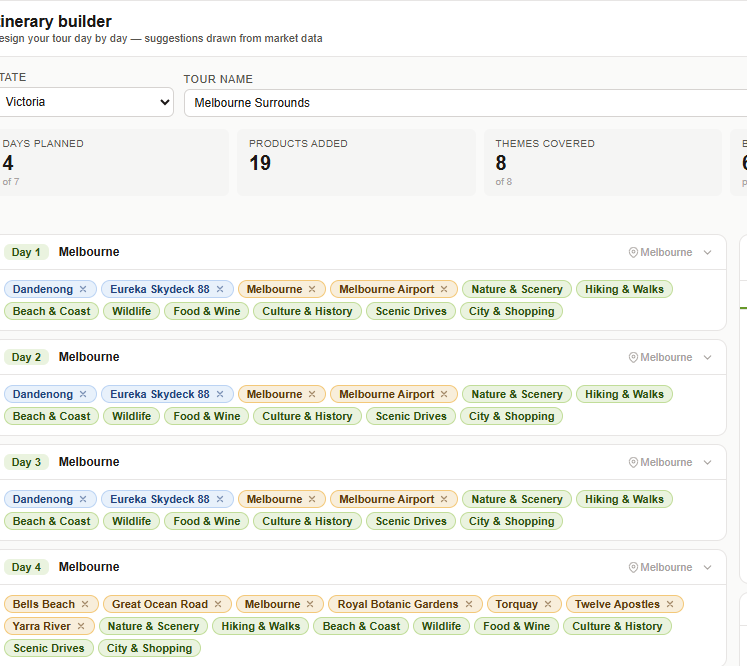

## Itinarery builder 

-[] here : Suggestions for Day 1 there should be a search for other places that are not mentioned in the suggested one. because not all the time pm will use the suggested ones right pm will search for other locations as well and add those in the itinearies. 

-[] in the itinerary builder there should be a url ot orginal itineray to double check : what do you think about that 

-[] the itinerary that are present here in the itinerary template they are just a general right and not the actuall itineraryies right because when i clicke on one they was showing repetative places    

if you see here () you will see that for all three days it is howing dangenong and eureka skydeck which is not a true itineriy that we have extracted what can we do to fix this or if not then why? 

-[] tagged data has not data here (Tagged data
The structured day-level asset behind every suggestion
Export
State

Western Australia
All sources
Board
Competitor
Every scraped day is broken to the day level, then a transparent rules-based engine extracts named products and maps each day to its themes. This is the asset every suggestion traces back to.
Tour	Source	Type	Day	City	Location	Product	Themes
)

## Product token editor

