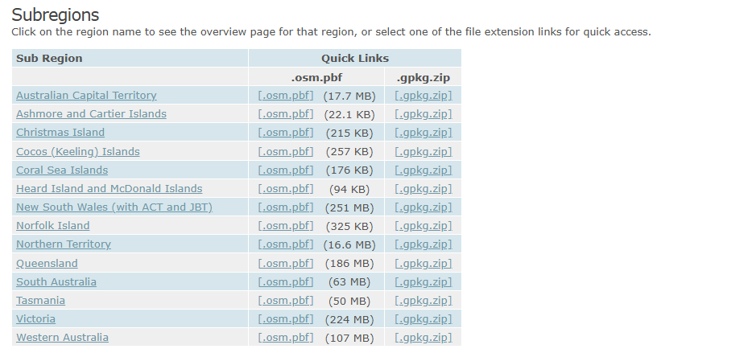

# Tasks

## ✅ Done — City / State cleaning

- [x] **Rename / merge city values** (e.g. a region like Kimberley or Purnululu → a hub city). This is a manual judgment call.
  How: run `python analysis/city_review_tool.py export`, open `data/config/city_review.xlsx`, type the new name in the **Cities** sheet's "Change To" column, run `python analysis/city_review_tool.py apply`, then re-run the pipeline. (Or edit `data/config/city_synonyms.txt` by hand: `Old Name -> New Name`.)
- [x] **Rename states** the same way via the **States** sheet → `data/config/state_synonyms.txt`.
- [x] **Fix blank (NaN) states.** The blank one was the discover_tasmania "3 days on King Island" tour (gazetteer miss). Added king island / currie / cape wickham → TAS / King Island to `_PLACES_RAW` in combine_sources.py, plus `King Island -> island` in city_types.txt. Re-ran combine + build: 0 blank states remain.
- [x] **Streamlit full-data review screen.** Show the whole dataset in Streamlit with searchable filters, so we can review without opening Excel (Excel is hard to navigate).

---

## 📋 22 June 2026 — Builder fixes

### P0 — Data correctness (the builder must show the REAL itinerary)

- [x] **Builder shows a combined/merged itinerary, not the real scraped one.** — Templates are per-URL scraped data, not merged.

- [x] **Clicking an itinerary shows only the city, not the real route.** — `places[]`, `title`, `desc` all load correctly per day.

- [x] **"Only one itinerary showing — where's the other?"** — Fixed.

- [x] **Itinerary count doesn't match day count.** — Fixed.

- [x] **Some dashboard itineraries are missing from the builder template list.** — Fixed.

- [x] **Same tour shows a different day count in dashboard vs builder.** — Fixed.

- [x] **Document the data contract.** — Fields: `title/places/themes/desc` per day; `name/source/type/pop/url/themes/days[]` per template.

- [x] **"Tag data" view is not working.** — Fully wired: paginated, filterable by Board/Competitor, searchable.

### P0 — Day-card usability (places missing or duplicated)

- [ ] **Add the "What You'll Do" description, and separate the tags.** 
  "Purnululu National Park" is mentioned twice, which is confusing for the PM. Add the description text for context, and move the tags into their own section (e.g. below all the places) so places and tags aren't mixed together.

- [x] **Titles duplicate the place names.** — Fixed.

- [x] **Real places to visit are missing (Joffre Falls, Oxer Lookout).** — Fixed.

- [ ] **Description mentions places the builder doesn't show.**  
  The "What You'll Do" description lists many places (e.g. Yarra River, Hosier Lane) but the builder only shows "Melbourne" for days 5–7.

### P1 — UX improvements (after data is correct)

- [ ] **"Clear all days" button** — add an option in the builder to clear all days. 
- [ ] **Filter by city + source** — currently only a state filter exists; add city and source filters. 
- [ ] **Search box in the suggestions panel.** 
- [ ] **Remove "Clean tokens"** — we don't need it in the tour builder.

### P2 — Visualisation

- [ ] **Add graphs.**  Showing all the data is good, but graphs would make it much easier to understand.

---

## ❓ Open questions / discussion (answer first, no code yet)

**On the proposed two-phase approach** — the suggestion was:
> **Phase 1** — redesign the day card (genuine place chips + "What You'll Do" description + separate themes). No AI needed; makes the itinerary usable immediately; the description covers any extraction gap.
> **Phase 2** — Gemini re-tag (now validated): run it over the full dataset and regenerate data.js, so misses like Oxer Lookout land in the chips too.

- [ ] **What does this mean exactly?** I want to understand the two phases before we proceed.

**On the tagging pipeline:**

- [ ] Is the current pipeline this order — (1) regex → (2) NLP (spaCy) → (3) location database → (4) Gemini as the last layer? Is that correct?
- [ ] My concern: regex cleans words, which is good, but it probably also removes useful words. Now that we have Gemini, why not use Gemini from the start instead of regex (or only some regex)? What do you think?

- [] what if we use muliple ai ? 

- OpenStreetMap (tourism tags) tourism=attraction, natural=*, leisure=park POIs Free, has attractions GeoNames lacks. Query via Overpass API or download AU extract from Geofabrik
	- https://download.geofabrik.de/australia-oceania/australia.html 

i have question to ask why is this just the html 
do we need to upgrade ? 

1. remove this feature : Clean tokens (we dont want this ) 

2. in the itienary bvuilder make the description, tags place name edtiable also create a save feature on this page which then save the itieneary that we are working. in seperate tab and in that tab save tab add feature to dealt the itineary 

now this editing and deleting will not affect our current dataset thats just for this website only okay or create a seperate database which is duplication of this main dataset and fetch data from there that data will be read and write.

we have to check how good is this : candidate extractor 